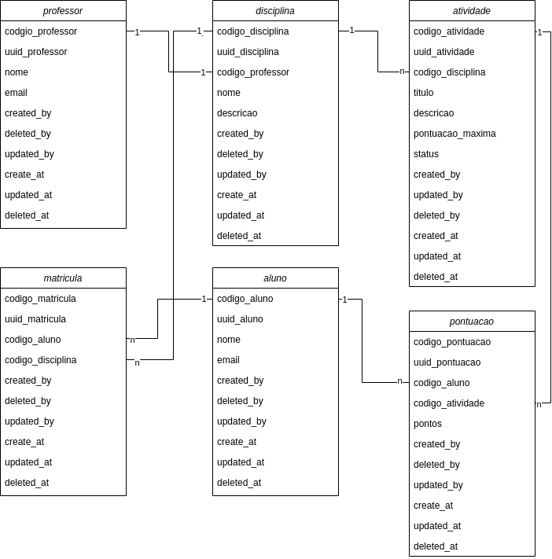

# 📌 Teste Moodle

**Descrição:**
Este projeto é uma API desenvolvida em Laravel com as seguintes funcionaliades: Gerenciamento de professores, alunos, disciplinas e atividades, registro e cálculo de notas e acompanhamento de desempenho dos alunos.

## 🚀 Tecnologias Utilizadas

-   Laravel 10
-   MySQL
-   PHP 8.1
-   Postman para testes

---

## 📖 Instalação e Configuração

1. Clone o repositório:
    ```bash
    git clone https://github.com/lgMolotto/Teste-Moodle.git
    ```
2. Entre no diretório do projeto:
    ```bash
    cd Teste-Moodle
    ```
3. Instale as dependências do Laravel:
    ```bash
    composer install
    ```
4. Copie o arquivo `.env.example` e configure o banco de dados:
    ```bash
    cp .env.example .env
    ```
5. Execute as migrations:
    ```bash
    php artisan migrate
    ```
6. Inicie o servidor:
    ```bash
    php artisan serve
    ```

---

## 📡 Códigos de Retorno da API

A API utiliza os seguintes códigos HTTP para indicar o status das operações:

200 OK - Requisição bem-sucedida.

201 Created - Recurso criado com sucesso.

404 Not Found - Recurso não encontrado.

409 Conflict - Conflito ao processar a requisição (exemplo: Aluno já matriculado na disciplina).

422 Unprocessable Entity - Os dados não passaram na validação (exemplo: email inválido ou dados obrigatórios não informados).

500 Internal Server Error - Erro inesperado no servidor.

---

## 📡 Endpoints da API

#### 🔹 📩 Importar a Coleção do Postman

[](postman/api_collection.json)

### 👨‍🏫 **Professores**

#### 🔹 Lista todos os professores

**GET** `/api/professores`

**Resposta:**

```json
{
    "success": true,
    "message": "Lista de professores",
    "data": { ... }
}
```

```json
{
    "nome": "João das Pedras",
    "email": "joaodaspedras@email.com"
}
```

**Resposta:**

```json
{
    "success": true,
    "message": "Professor cadastrado com sucesso!",
    "data": { ... }
}
```

#### 🔹 Busca um professor

**GET** `/api/professores/{uuid}/show`
| Parâmetro | Descrição |
| :---------- | :------------------------------------------ |
| `uuid` | O uuid do professor. **Obrigatório** |

**Resposta:**

```json
{
    "success": true,
    "message": "Dados do professor",
    "data": { ... }
}

```

#### 🔹 Edita um professor

**PUT** `/api/professores/{uuid}/update`
| Parâmetro | Descrição |
| :---------- | :------------------------------------------ |
| `uuid` | O uuid do professor. **Obrigatório** |

```json
{
    "nome": "João da Rocha",
    "email": "joaodarocha@email.com"
}
```

**Resposta:**

```json
{
    "success": true,
    "message": "Professor editado com sucesso!",
    "data": ""
}
```

#### 🔹 Inativar um professor

**DELETE** `/api/professores/{uuid}/delete`
| Parâmetro | Descrição |
| :---------- | :------------------------------------------ |
| `uuid` | O uuid do professor. **Obrigatório** |

**Resposta:**

```json
{
    "success": true,
    "message": "Professor inativado com sucesso!",
    "data": ""
}
```

#### 🔹 Reativar um professor

**PATCH** `/api/professores/{uuid}/restore`
| Parâmetro | Descrição |
| :---------- | :------------------------------------------ |
| `uuid` | O uuid do professor. **Obrigatório** |

**Resposta:**

```json
{
    "success": true,
    "message": "Professor reativado com sucesso!",
    "data": ""
}
```

#### 🔹 Disciplinas do professor

**GET** `/api/professores/{uuid}/disciplinas`
| Parâmetro | Descrição |
| :---------- | :------------------------------------------ |
| `uuid` | O uuid do professor. **Obrigatório** |

**Resposta:**

```json
{
    "success": true,
    "message": "Disciplinas do professor",
    "data": { ... }
}
```

### 🎓 **Alunos**

#### 🔹 Lista todos os alunos

**GET** `/api/alunos`

**Resposta:**

```json
{
    "success": true,
    "message": "Lista de alunos",
    "data": { ... }
}
```

#### 🔹 Cria um aluno

**POST** `/api/alunos/store`

```json
{
    "nome": "Maria das Flores",
    "email": "mariadasflores@email.com"
}
```

**Resposta:**

```json
{
    "success": true,
    "message": "Aluno cadastrado com sucesso!",
    "data": { ... }
}
```

#### 🔹 Busca um aluno

**GET** `/api/alunos/{uuid}/show`
| Parâmetro | Descrição |
| :---------- | :------------------------------------------ |
| `uuid` | O uuid do aluno. **Obrigatório** |

**Resposta:**

```json
{
    "success": true,
    "message": "Lista de alunos",
    "data": { ... }
}

```

#### 🔹 Edita um aluno

**PUT** `/api/alunos/{uuid}/update`
| Parâmetro | Descrição |
| :---------- | :------------------------------------------ |
| `uuid` | O uuid do aluno. **Obrigatório** |

```json
{
    "nome": "Maria da luz",
    "email": "mariadaluz@email.com"
}
```

**Resposta:**

```json
{
    "success": true,
    "message": "Aluno editado com sucesso!",
    "data": ""
}
```

#### 🔹 Inativar um aluno

**DELETE** `/api/alunos/{uuid}/delete`
| Parâmetro | Descrição |
| :---------- | :------------------------------------------ |
| `uuid` | O uuid do aluno. **Obrigatório** |

**Resposta:**

```json
{
    "success": true,
    "message": "Aluno inativado com sucesso!",
    "data": ""
}
```

#### 🔹 Reativar um aluno

**PATCH** `/api/alunos/{uuid}/restore`
| Parâmetro | Descrição |
| :---------- | :------------------------------------------ |
| `uuid` | O uuid do aluno. **Obrigatório** |

**Resposta:**

```json
{
    "success": true,
    "message": "Aluno reativado com sucesso!",
    "data": ""
}
```

#### 🔹 Atividades do aluno

**GET** `/api/alunos/{uuid}/atividades`
| Parâmetro | Descrição |
| :---------- | :------------------------------------------ |
| `uuid` | O uuid do aluno. **Obrigatório** |

**Resposta:**

```json
{
    "success": true,
    "message": "Atividades do aluno",
    "data": { ... }
}
```

#### 🔹 Notas do aluno

**GET** `/api/alunos/{uuid}/notas`
| Parâmetro | Descrição |
| :---------- | :------------------------------------------ |
| `uuid` | O uuid do aluno. **Obrigatório** |

**Resposta:**

```json
{
    "success": true,
    "message": "Notas do aluno",
    "data": { ... }
}
```

### 📖 **Disciplinas**

#### 🔹 Lista todas as disciplinas

**GET** `/api/disciplinas`

**Resposta:**

```json
{
    "success": true,
    "message": "Lista de disciplinas",
    "data": { ... }
}
```

#### 🔹 Cria uma disciplina

**POST** `/api/disciplinas/store`

```json
{
    "nome": "Cálculo numérico I",
    "descricao": "Descrição da disciplina de Cálculo numérico I.",
    "uuid_professor": "{uuid_professor}" // UUID do professor que lecionará a disciplina
}
```

**Resposta:**

```json
{
    "success": true,
    "message": "Disciplina cadastrada com sucesso!",
    "data": { ... }
}
```

#### 🔹 Busca uma disciplina

**GET** `/api/disciplinas/{uuid}/show`
| Parâmetro | Descrição |
| :---------- | :------------------------------------------ |
| `uuid` | O uuid da disciplina. **Obrigatório** |

**Resposta:**

```json
{
    "success": true,
    "message": "Lista de disciplinas",
    "data": { ... }
}

```

#### 🔹 Edita uma disciplina

**PUT** `/api/disciplinas/{uuid}/update`
| Parâmetro | Descrição |
| :---------- | :------------------------------------------ |
| `uuid` | O uuid da disciplina. **Obrigatório** |

```json
{
    "nome": "Cálculo numérico II",
    "descricao": "Descrição da disciplina de cálculo numérico II.",
    "uuid_professor": "{uuid_professor}"
}
```

**Resposta:**

```json
{
    "success": true,
    "message": "Disciplina editada com sucesso!",
    "data": ""
}
```

#### 🔹 Inativar uma disciplina

**DELETE** `/api/disciplinas/{uuid}/delete`
| Parâmetro | Descrição |
| :---------- | :------------------------------------------ |
| `uuid` | O uuid da disciplina. **Obrigatório** |

**Resposta:**

```json
{
    "success": true,
    "message": "Disciplina inativada com sucesso!",
    "data": ""
}
```

#### 🔹 Reativar uma disciplina

**PATCH** `/api/disciplinas/{uuid}/restore`
| Parâmetro | Descrição |
| :---------- | :------------------------------------------ |
| `uuid` | O uuid da disciplina. **Obrigatório** |

**Resposta:**

```json
{
    "success": true,
    "message": "Disciplina reativada com sucesso!",
    "data": ""
}
```

#### 🔹 Busca as atividades da disciplina

**GET** `/api/disciplinas/{uuid}/atividades`
| Parâmetro | Descrição |
| :---------- | :------------------------------------------ |
| `uuid` | O uuid da disciplina. **Obrigatório** |

**Resposta:**

```json
{
    "success": true,
    "message": "Atividades da disciplina",
    "data": { ... }
}

```

#### 🔹 Busca as médias dos alunos da disciplina

**GET** `/api/disciplinas/{uuid}/medias`
| Parâmetro | Descrição |
| :---------- | :------------------------------------------ |
| `uuid` | O uuid da disciplina. **Obrigatório** |

**Resposta:**

```json
{
    "success": true,
    "message": "Médias da disciplina",
    "data": { ... }
}

```

#### 🔹 Busca o ranking dos 10 alunos com mais nota da disciplina

**GET** `/api/disciplinas/{uuid}/ranking`
| Parâmetro | Descrição |
| :---------- | :------------------------------------------ |
| `uuid` | O uuid da disciplina. **Obrigatório** |

**Resposta:**

```json
{
    "success": true,
    "message": "Ranking dos alunos",
    "data": { ... }
}

```

### 📚 **Atividades**

#### 🔹 Lista todas as atividades

**GET** `/api/atividades`

**Resposta:**

```json
{
    "success": true,
    "message": "Lista de atividades",
    "data": { ... }
}
```

#### 🔹 Cria uma atividade

**POST** `/api/atividades/store`

```json
{
    "titulo": "Prova 1",
    "descricao": "Prova para compor a nota do 2º bimestre da disciplina Cálculo Numérico I.",
    "uuid_disciplina": "{uuid_disciplina}", // UUID da disciplina que a atividade será atribuida
    "pontuacao_maxima": "20.00" // Pontuação máxima da atividade
}
```

**Resposta:**

```json
{
    "success": true,
    "message": "Atividade cadastrada com sucesso!",
    "data": { ... }
}
```

#### 🔹 Busca uma atividade

**GET** `/api/atividades/{uuid}/show`
| Parâmetro | Descrição |
| :---------- | :------------------------------------------ |
| `uuid` | O uuid da atividade. **Obrigatório** |

**Resposta:**

```json
{
    "success": true,
    "message": "Dados da atividades",
    "data": { ... }
}

```

#### 🔹 Edita uma atividade

**PUT** `/api/atividades/{uuid}/update`
| Parâmetro | Descrição |
| :---------- | :------------------------------------------ |
| `uuid` | O uuid da atividade. **Obrigatório** |

```json
{
    "titulo": "Prova 1",
    "descricao": "Prova para compor a nota do 3º bimestre da disciplina de Cálculo numérico I",
    "uuid_disciplina": "{uuid_disciplina}",
    "pontuacao_maxima": "50.00"
}
```

**Resposta:**

```json
{
    "success": true,
    "message": "Atividade editada com sucesso!",
    "data": ""
}
```

#### 🔹 Inativar uma atividade

**DELETE** `/api/atividades/{uuid}/delete`
| Parâmetro | Descrição |
| :---------- | :------------------------------------------ |
| `uuid` | O uuid da atividade. **Obrigatório** |

**Resposta:**

```json
{
    "success": true,
    "message": "Atividade inativada com sucesso!",
    "data": ""
}
```

#### 🔹 Reativar uma atividade

**PATCH** `/api/atividades/{uuid}/restore`
| Parâmetro | Descrição |
| :---------- | :------------------------------------------ |
| `uuid` | O uuid da atividade. **Obrigatório** |

**Resposta:**

```json
{
    "success": true,
    "message": "Atividade reativada com sucesso!",
    "data": ""
}
```

#### 🔹 Avalia um aluno

**POST** `/api/atividades/avaliar-aluno`

```json
{
    "uuid_atividade": "{uuid_atividade}", // UUID da atividade que será avaliada
    "uuid_aluno": "{uuid_aluno}", // UUID do aluno que será avaliado
    "nota": "15.00"
}
```

**Resposta:**

```json
{
    "success": true,
    "message": "Nota atribuida com sucesso!",
    "data": ""
}
```

#### 🔹 Finalizar uma atividade

**PATCH** `/api/atividades/{uuid}/finalizar`
| Parâmetro | Descrição |
| :---------- | :------------------------------------------ |
| `uuid` | O uuid da atividade. **Obrigatório** |

**Resposta:**

```json
{
    "success": true,
    "message": "Atividade finalizada com sucesso!",
    "data": ""
}
```

### 🏫 **Matrícula**

#### 🔹 Cria uma matrícula (vincula aluno com disciplina)

**POST** `/api/matriculas/store`

```json
{
    "uuid_aluno": "{uuid_aluno}", // UUID do aluno que será matriculado na disciplina
    "uuid_disciplina": "{uuid_disciplina}" // UUID da disciplina que o aluno será maticulado
}
```

**Resposta:**

```json
{
    "success": true,
    "message": "Aluno matriculado com sucesso!",
    "data": ""
}
```

#### 🔹 Inativar uma matrícula

**DELETE** `/api/matriculas/{uuid}/delete`
| Parâmetro | Descrição |
| :---------- | :------------------------------------------ |
| `uuid` | O uuid da matricula. **Obrigatório** |

**Resposta:**

```json
{
    "success": true,
    "message": "Matricula inativada com sucesso!",
    "data": ""
}
```

#### 🔹 Reativar uma matrícula

**PATCH** `/api/matriculas/{uuid}/restore`
| Parâmetro | Descrição |
| :---------- | :------------------------------------------ |
| `uuid` | O uuid da matricula. **Obrigatório** |

**Resposta:**

```json
{
    "success": true,
    "message": "Matricula reativada com sucesso!",
    "data": ""
}
```

---

## 🗄️ Estrutura do Banco de Dados



### 📌 **Tabela: professor**

| Campo            | Tipo         | Null  |
| ---------------- | ------------ | ----- |
| codigo_professor | bigint       | false |
| uuid_professor   | char(36)     | false |
| nome             | varchar(255) | false |
| email            | varchar(255) | false |
| created_by       | bigint       | false |
| deleted_by       | bigint       | true  |
| updated_by       | bigint       | true  |
| created_at       | timestamp    | true  |
| updated_at       | timestamp    | true  |
| deleted_at       | timestamp    | true  |

### 📌 **Tabela: atividade**

| Campo             | Tipo         | Null  |
| ----------------- | ------------ | ----- |
| codigo_atividade  | bigint       | false |
| uuid_atividade    | char(36)     | false |
| codigo_disciplina | varchar(255) | false |
| titulo            | varchar(255) | false |
| descricao         | text         | true  |
| pontuacao_maxima  | decimal      | false |
| status            | char(1)      | false |
| created_by        | bigint       | true  |
| deleted_by        | bigint       | true  |
| updated_by        | bigint       | true  |
| created_at        | timestamp    | true  |
| updated_at        | timestamp    | true  |
| deleted_at        | timestamp    | true  |

### 📌 **Tabela: matricula**

| Campo             | Tipo      | Null  |
| ----------------- | --------- | ----- |
| codigo_matricula  | bigint    | false |
| uuid_matricula    | char(36)  | false |
| codigo_aluno      | bigint    | false |
| codigo_disciplina | bigint    | false |
| created_by        | bigint    | true  |
| deleted_by        | bigint    | true  |
| updated_by        | bigint    | true  |
| created_at        | timestamp | true  |
| updated_at        | timestamp | true  |
| deleted_at        | timestamp | true  |

### 📌 **Tabela: disciplina**

| Campo             | Tipo         | Null  |
| ----------------- | ------------ | ----- |
| codigo_disciplina | bigint       | false |
| uuid_disciplina   | char(36)     | false |
| codigo_professor  | bigint       | false |
| nome              | varchar(255) | false |
| email             | varchar(255) | false |
| created_by        | bigint       | true  |
| deleted_by        | bigint       | true  |
| updated_by        | bigint       | true  |
| created_at        | timestamp    | true  |
| updated_at        | timestamp    | true  |
| deleted_at        | timestamp    | true  |

### 📌 **Tabela: aluno**

| Campo        | Tipo         | Null  |
| ------------ | ------------ | ----- |
| codigo_aluno | bigint       | false |
| uuid_aluno   | char(36)     | false |
| nome         | varchar(255) | false |
| email        | varchar(255) | false |
| created_by   | bigint       | true  |
| deleted_by   | bigint       | true  |
| updated_by   | bigint       | true  |
| created_at   | timestamp    | true  |
| updated_at   | timestamp    | true  |
| deleted_at   | timestamp    | true  |

### 📌 **Tabela: pontuacao**

| Campo            | Tipo         | Null  |
| ---------------- | ------------ | ----- |
| codigo_pontuacao | bigint       | false |
| uuid_pontuacao   | char(36)     | false |
| codigo_aluno     | bigint       | false |
| codigo_atividade | bigint       | false |
| nota             | decimal(5,2) | false |
| created_by       | bigint       | true  |
| deleted_by       | bigint       | true  |
| updated_by       | bigint       | true  |
| created_at       | timestamp    | true  |
| updated_at       | timestamp    | true  |
| deleted_at       | timestamp    | true  |
